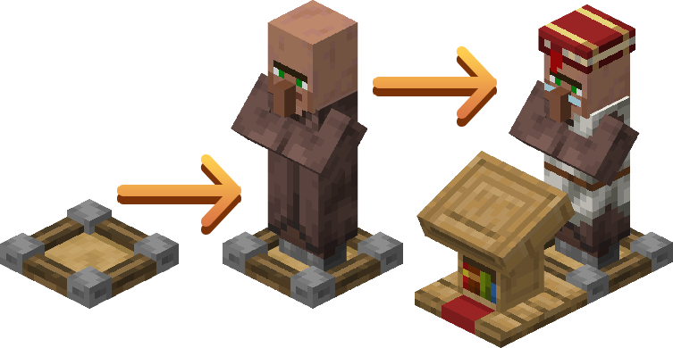
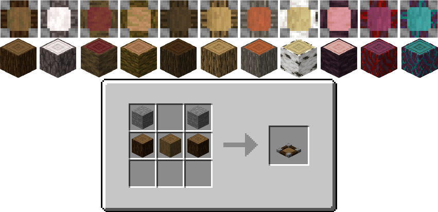

# ✨Take Full Control of Your Trading Hall!
A vanilla-like **Fabric** mod for Minecraft 1.21.11 that adds **Villager Post** to help you manage your trading halls with style and precision.
# 🎮 How to Use
To ensure a villager is strictly locked to a specific block, follow these steps:
* **Place the Post:** Set down a Villager Post in your desired location.
* **Seat the Villager:** Place the villager directly into the post
* **Assign Profession:** Place the Profession Block (Workstation) directly in front of them to lock their trade.
* **Redstone:** If the post is powered by Redstone, it will stop holding the villager, allowing them to move freely.

# 📦 Crafting

